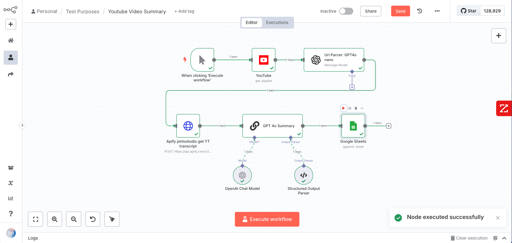
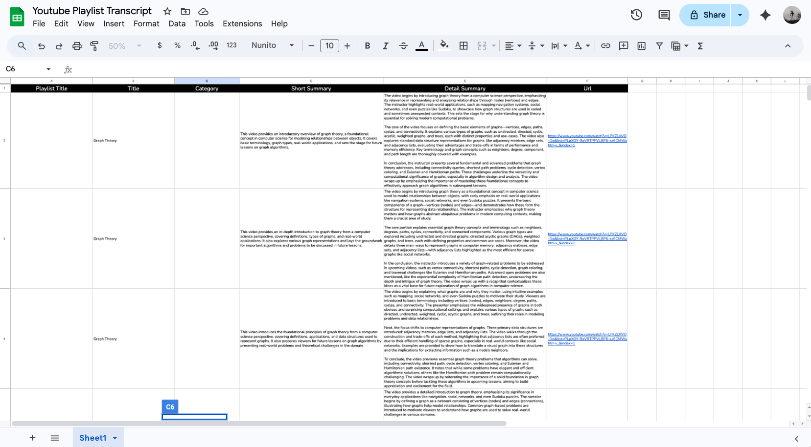

# YouTube Playlist AI Summarization Workflow

An automated n8n workflow that extracts YouTube playlist videos, scrapes transcripts, and generates AI summaries using OpenAI GPT models.




## What It Does

1. **Extracts** individual video URLs from YouTube playlists
2. **Scrapes** video transcripts using [Apify's YouTube Transcript Scraper](https://apify.com/pintostudio/youtube-transcript-scraper)
3. **Generates** AI-powered summaries (short + detailed)
4. **Saves** results to Google Sheets automatically

## Workflow Components

- **Manual Trigger** → **YouTube API** → **URL Parser (GPT-4o Nano)** → **Transcript Scraper (Apify)** → **AI Summary (GPT-4o Chain)** → **Google Sheets**

### Key Nodes:
- **YouTube API**: Fetches playlist metadata
- **URL Parser**: GPT-4o Nano generates individual video URLs
- **HTTP Request**: Apify transcript scraper
- **LLM Chain**: GPT-4o with structured output for summaries
- **Google Sheets**: Stores results

## Setup Requirements

### API Keys Needed:
- YouTube Data API v3 (OAuth2)
- OpenAI API (GPT-4o models)
- Apify API ([sign up here](https://apify.com/))
- Google Sheets API (OAuth2)

### Google Sheet Columns:
`Title | Short Summary | Detail Summary | URL`

## Configuration

1. Import workflow to n8n
2. Add your API credentials
3. Update Google Sheet ID
4. Change playlist ID in YouTube node
5. Modify video index in HTTP Request (currently index [3])

## Usage

Click "Execute workflow" → Automated processing → Results in Google Sheets

## Output Format

```json
{
  "short_summary": "Two sentences: main topic + key takeaway",
  "detailed_summary": "Three paragraphs: intro, content, conclusions"
}
```

## Scaling

To process all playlist videos:
- Add **Split In Batches** node after URL parser
- Loop through all video URLs instead of single index

## Use Cases

- Content research and competitor analysis
- Educational content summarization
- Marketing trend analysis
- Conference/training material processing

Perfect for analyzing YouTube content at scale with AI-powered insights!
